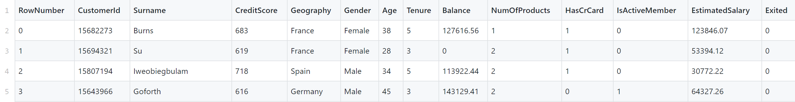

# Data Pre-Processing Discussions
### Address the data properties before building models

Looking at this snapshot of the train.csv file below:

There are a few notable problems of this dataset:
1. RowNumber, CustomerId and Surname are redundant attributes
    - we may simply remove these
2. Geography is a categorical attribute in text form
    - use a technique called OneHotEncoding we can split Geography into three attributes:
        - Geography_France, Geography_Spain, Geography_Germany where each of these attributes is a binary attribute of [0,1]
3. For continuous values such as CreditScore, EstimatedSalary and Balance, the scales are different
    - Normalization process may be needed for distance based models (KNN, SVM etc.)
        - min-max or z-score normalization?
    - Will discretization to improve our models?
        - Cluster analysis
Other things we need to consider before building a model include:
1. Are attributes independent or dependent (Redundancy)? 
    - How do we computer independence? 
        - Nominal data: Chi-square 
        - Numeric data: Correlation coefficient
        - General data: Mutual Information
2. Noise and Outliers:
    - Can we remove any outliers and smooth out the noise (if any)?
3. Data Reduction: 
    - Dimensionality reduction: are there any redundant variables?
        - PCA analysis
    
